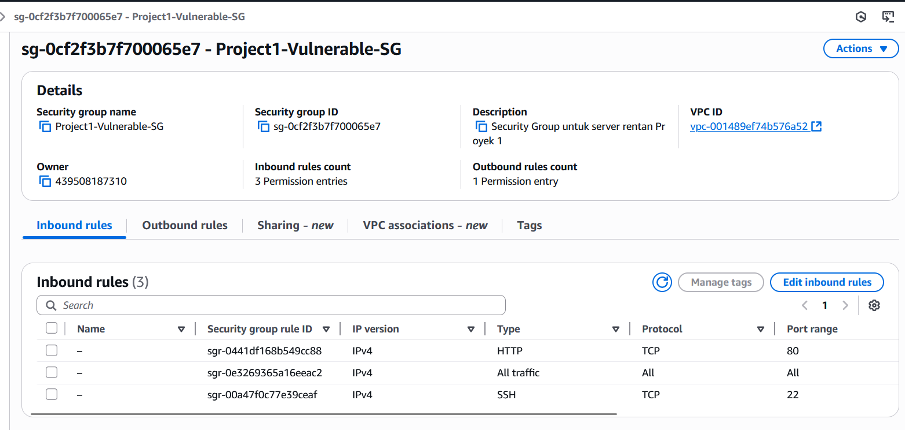
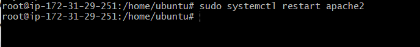

# Portofolio Keamanan AWS - Shalahuddin Al-Ayyubi

Selamat datang di portofolio proyek keamanan cloud saya. Repositori ini berisi dokumentasi dan artefak dari proyek-proyek yang saya kerjakan untuk mendemonstrasikan keahlian saya di bidang AWS, Pentesting, dan Otomatisasi Keamanan.

---

## Daftar Proyek

### Proyek 1: Analisis Kerentanan & Hardening EC2
* **Tujuan:** Mensimulasikan setup server yang sengaja dibuat rentan di **AWS EC2**, kemudian melakukan pemindaian keamanan, eksploitasi, dan diakhiri dengan proses *hardening* (perbaikan) menggunakan AWS Security Groups dan konfigurasi server yang aman.
* **Teknologi:** `AWS EC2`, `Security Groups`, `Apache2`, `PHP`, `MySQL`, `DVWA`, `Nmap`, `Nikto`.
* **Status:** `Selesai` 🎉

### Proyek 2: "Flag API" Serverless
* **Tujuan:** Membangun sebuah API *endpoint* sederhana menggunakan arsitektur *serverless* AWS untuk menerima dan memvalidasi *flag* CTF.
* **Teknologi:** `AWS Lambda`, `AWS API Gateway`, `Python`.
* **Status:** `Selesai` 🎉

### Proyek 3: Mini-CTF dengan Scoreboard
* **Tujuan:** Menggabungkan Proyek 1 & 2 untuk membuat sebuah platform mini-CTF lengkap dengan *scoreboard* yang dinamis.
* **Teknologi:** `AWS EC2`, `Lambda`, `API Gateway`, `DynamoDB`.
* **Status:** `Belum Dimulai`

---

## Detail Proyek 1: Analisis Kerentanan & Hardening EC2

*(... Bagian Proyek 1 yang sudah lengkap tetap di sini ...)*

### Fase 1: Setup Infrastruktur Awal (AWS EC2)
*(... Isi Fase 1 ...)*


* #### Konfigurasi Firewall (Security Group) - Sengaja Dibuka Lebar
    *(... Isi Konfigurasi Firewall Rentan ...)*
    
    

### Fase 2: Setup Server & Aplikasi Target (DVWA)
*(... Isi Fase 2 ...)*
1.  **Update Server:**
    *(... Isi Update Server ...)*
    
2.  **Instal LAMP Stack:**
    *(... Isi Instal LAMP ...)*
    
    
3.  **Verifikasi Web Server:**
    *(... Isi Verifikasi Web Server ...)*
    
4.  **Instal DVWA:**
    *(... Isi Instal DVWA ...)*
    
5.  **Konfigurasi Izin File (Sengaja Dibuat Rentan):**
    *(... Isi Konfigurasi Izin Rentan ...)*
    
6.  **Setup Database & DVWA:**
    *(... Isi Setup Database DVWA ...)*

### Fase 3: Analisis Kerentanan Awal (Sebelum Diserang)
*(... Isi Analisis Kerentanan Awal ...)*

### Fase 4: Pengujian & Eksploitasi (Menyerang Target)

#### 1\. Reconnaissance (Nmap)
*(... Isi Reconnaissance Nmap ...)*


#### 2\. Vulnerability Assessment (Nikto)
*(... Isi Vulnerability Assessment Nikto ...)*


#### 3\. Exploitation (Eksploitasi)

**a. SQL Injection (SQLi)**
*(... Isi Eksploitasi SQLi ...)*


**b. Web Shell Upload & Remote Code Execution (RCE)**
*(... Isi Eksploitasi Web Shell ...)*


**Kesimpulan Eksploitasi:** *(... Isi Kesimpulan Eksploitasi ...)*

### Fase 5: Hardening (Memperbaiki Celah)

#### 1\. Memperbaiki Firewall (Security Group)
*(... Isi Hardening Security Group ...)*



#### 2\. Memperbaiki Izin File Server
*(... Isi Hardening Izin File ...)*


#### 3\. Memperbaiki Konfigurasi Apache
*(... Isi Hardening Apache Conf ...)*



#### 4\. Menonaktifkan Eksekusi PHP di Folder Uploads (`.htaccess`)
*(... Isi Hardening .htaccess ...)*


#### 5\. Verifikasi Hardening
*(... Isi Verifikasi Hardening ...)*


**Kesimpulan Hardening:** *(... Isi Kesimpulan Hardening ...)*

---

## Detail Proyek 2: "Flag API" Serverless

Proyek ini bertujuan membuat API sederhana untuk mengecek *flag* CTF tanpa perlu mengelola server. Saya menggunakan **AWS Lambda** untuk kode logikanya dan **AWS API Gateway** sebagai *endpoint* HTTP.

### Fase 1: Membuat Fungsi Lambda (Logika Pengecekan)

Langkah pertama adalah membuat fungsi Lambda yang akan berisi kode Python untuk memeriksa *flag*.

1.  **Mencari Layanan Lambda:** Dari AWS Management Console, saya mencari layanan "Lambda".
    

2.  **Memulai Pembuatan Fungsi:** Di halaman Lambda, saya klik "Create function".
    

3.  **Konfigurasi Dasar:** Saya memilih "Author from scratch", memberi nama fungsi `flag-checker-api`, dan memilih `Python 3.12` sebagai *runtime*.
    

4.  **Konfigurasi Izin:** Saya membiarkan opsi *default* "Create a new role with basic Lambda permissions" agar AWS otomatis membuatkan *role* IAM dasar. Setelah itu klik "Create function".
    

5.  **Editor Kode:** Fungsi berhasil dibuat dan saya diarahkan ke editor kode *online*.
    

6.  **Menulis Kode Logika:** Saya mengganti kode *template* dengan kode Python berikut:
    ```python
    import json

    # Definisikan flag yang benar (seharusnya disimpan lebih aman, tapi ini contoh)
    CORRECT_FLAG = "CTF{th1s_1s_th3_s3cr3t_fl4g}"

    def lambda_handler(event, context):
        """
        Fungsi utama Lambda untuk mengecek flag yang dikirim via API Gateway.
        """
        print(f"Received event: {json.dumps(event)}") # Mencatat event yang masuk ke log
        response_body = {}
        status_code = 200
        try:
            if 'body' in event and event['body']:
                body = json.loads(event['body'])
                submitted_flag = body.get('flag')
            else: submitted_flag = None
            if submitted_flag:
                if submitted_flag == CORRECT_FLAG:
                    response_body = {'message': 'Flag Benar! Selamat!'}
                else:
                    response_body = {'message': 'Flag Salah. Coba lagi.'}; status_code = 400
            else:
                response_body = {'message': 'Harap kirim flag dalam format JSON: {"flag": "nilai_flag"}'}; status_code = 400
        except json.JSONDecodeError:
            response_body = {'message': 'Body request harus dalam format JSON yang valid.'}; status_code = 400
        except Exception as e:
            response_body = {'message': f'Internal server error: {str(e)}'}; status_code = 500
        return {
            'statusCode': status_code,
            'headers': { 'Content-Type': 'application/json', 'Access-Control-Allow-Origin': '*' },
            'body': json.dumps(response_body)
        }
    ```

7.  **Deploy Kode:** Setelah menempelkan kode, saya klik tombol "Deploy".
    
    

### Fase 2: Membuat API Gateway (Endpoint HTTP)

Selanjutnya, saya membuat *endpoint* HTTP publik menggunakan **API Gateway**.

1.  **Mencari Layanan API Gateway:** Kembali ke AWS Console, saya mencari "API Gateway".
    

2.  **Memulai Pembuatan API:** Di halaman API Gateway, saya klik "Create API".
    

3.  **Memilih Tipe REST API:** Saya memilih tipe **REST API** (Publik) dan klik "Build".
    

4.  **Konfigurasi Dasar API:** Saya memilih "New API", memberi nama `FlagCheckerAPI`, deskripsi (opsional), dan membiarkan *Endpoint Type* "Regional", lalu klik "Create API".
    

5.  **Membuat Resource:** Di panel *Resources*, saya klik "Actions" > "Create resource".
    
    Saya memberi nama *resource* `checkflag` dan klik "Create resource".
    

6.  **Membuat Method:** Dengan *resource* `/checkflag` terpilih, saya klik "Actions" > "Create Method".
    
    Saya memilih `POST` dari *dropdown* dan klik tanda centang (✓).

7.  **Konfigurasi Integrasi Lambda:** Pada halaman setup *method* POST:
    * **Integration type:** `Lambda Function`
    * **Use Lambda Proxy integration:** Dicentang ✅
    * **Lambda Function:** Memilih fungsi `flag-checker-api` yang sudah dibuat.
    * Kemudian klik **Save** dan **OK** pada *pop-up* izin.
    
    

8.  **Deploy API:** Saya klik tombol "Deploy API".
    
    Saya membuat *stage* baru dengan nama `prod` dan klik "Deploy".
    

9.  **Mendapatkan Invoke URL:** Setelah *deploy*, API Gateway menampilkan **Invoke URL** untuk *stage* `prod`. URL *endpoint* lengkapnya adalah URL ini ditambah `/checkflag`.
    
    * **Endpoint URL:** `https://447hqjwxwg.execute-api.us-east-1.amazonaws.com/prod/checkflag`

### Fase 3: Pengujian API

Saya menguji *endpoint* API menggunakan `curl` dari terminal:

* **Tes Flag Benar:**
    ```bash
    curl -X POST \
      [https://447hqjwxwg.execute-api.us-east-1.amazonaws.com/prod/checkflag](https://447hqjwxwg.execute-api.us-east-1.amazonaws.com/prod/checkflag) \
      -H 'Content-Type: application/json' \
      -d '{"flag": "CTF{th1s_1s_th3_s3cr3t_fl4g}"}'
    ```
    * **Respons:** `{"message": "Flag Benar! Selamat!"}` ✅
        

* **Tes Flag Salah:**
    ```bash
    curl -X POST \
      [https://447hqjwxwg.execute-api.us-east-1.amazonaws.com/prod/checkflag](https://447hqjwxwg.execute-api.us-east-1.amazonaws.com/prod/checkflag) \
      -H 'Content-Type: application/json' \
      -d '{"flag": "flag_salah_coba_coba"}'
    ```
    * **Respons:** `{"message": "Flag Salah. Coba lagi."}` ✅
        *(Screenshot tes flag salah opsional)*

**Kesimpulan Proyek 2:** Berhasil membuat dan menguji API *serverless* sederhana menggunakan AWS Lambda dan API Gateway untuk validasi input. Ini menunjukkan pemahaman dasar arsitektur *serverless* di AWS.

---

*(... Tempat untuk Proyek 3 ...)*
