# Portofolio Keamanan AWS - Shalahuddin Al-Ayyubi

Selamat datang di portofolio proyek keamanan cloud saya. Repositori ini berisi dokumentasi dan artefak dari proyek-proyek yang saya kerjakan untuk mendemonstrasikan keahlian saya di bidang AWS, Pentesting, dan Otomatisasi Keamanan.

---

## Daftar Proyek

### Proyek 1: Analisis Kerentanan & Hardening EC2
* **Tujuan:** Mensimulasikan server yang sengaja dibuat rentan di AWS EC2, melakukan pemindaian keamanan, dan kemudian melakukan *hardening* (perbaikan) menggunakan AWS Security Groups dan Network ACLs.
* **Teknologi:** `AWS EC2`, `Security Groups`, `Apache2`, `PHP`, `MySQL`, `DVWA`, `Nmap`.
* **Status:** `Selesai`

### Proyek 2: "Flag API" Serverless
* **Tujuan:** Membangun sebuah API sederhana untuk *submit flag* CTF menggunakan arsitektur *serverless* (tanpa server).
* **Teknologi:** `AWS Lambda`, `AWS API Gateway`, `Python`.
* **Status:** `Selesai`

### Proyek 3: Mini-CTF dengan Scoreboard
* **Tujuan:** Menggabungkan Proyek 1 & 2 untuk membuat sebuah platform mini-CTF lengkap dengan *scoreboard* yang dinamis.
* **Teknologi:** `AWS EC2`, `Lambda`, `API Gateway`, `DynamoDB`.
* **Status:** `Belum Dimulai`

---

## Detail Proyek 1: Analisis Kerentanan & Hardening EC2

Proyek ini dibagi menjadi beberapa fase. Fase pertama adalah *setup* infrastruktur dan aplikasi yang sengaja dibuat rentan.

### Fase 1: Setup Infrastruktur (AWS EC2)

Saya memulai dengan meluncurkan sebuah *instance* EC2 baru dengan konfigurasi berikut:
* **Name:** `Project1-Vulnerable-Server`
* **OS (AMI):** `Ubuntu Server 24.04 LTS` (Free tier eligible)
* **Instance Type:** `t2.micro` (Free tier eligible)
* **Key Pair:** `aws-project1-key` (dibuat baru dan disimpan dengan aman)


* #### Konfigurasi Firewall (Security Group)
Bagian terpenting adalah konfigurasi *Security Group*. Untuk tujuan proyek ini, saya **sengaja membuat aturan yang sangat tidak aman** agar bisa dianalisis nanti.

* **Security Group Name:** `Project1-Vulnerable-SG`
* **Inbound Rules:**
    1.  `Type: SSH` (Port 22), `Source: Anywhere (0.0.0.0/0)`
    2.  `Type: HTTP` (Port 80), `Source: Anywhere (0.0.0.0/0)`
    3.  `Type: All traffic` (All ports), `Source: Anywhere (0.0.0.0/0)`


### Fase 2: Setup Server & Aplikasi Rentan (DVWA)

Setelah *instance* berjalan, saya terhubung ke server menggunakan SSH dan file `.pem` saya.

1.  **Update Server:** Pertama, saya memperbarui semua *package manager*.
    ```bash
    apt update && apt upgrade -y
    ```
    

2.  **Instal LAMP Stack:** Saya menginstal Apache (Web Server), MySQL (Database), dan PHP.
    ```bash
    apt install apache2 -y
    apt install php libapache2-mod-php php-mysql mysql-server -y
    ```
    
    

3.  **Verifikasi Web Server:** Saya mengakses IP Publik server (`http://98.93.196.5`) dari browser dan memverifikasi bahwa halaman default Apache telah aktif.
    

4.  **Instal DVWA:** Saya mengunduh (clone) aplikasi *Damn Vulnerable Web Application* (DVWA) dari GitHub.
    ```bash
    git clone [https://github.com/digininja/DVWA.git](https://github.com/digininja/DVWA.git) /var/www/html/dvwa
    ```
    

5.  **Konfigurasi Izin (Sengaja Dibuat Rentan):** Saya memberikan izin `777` (baca, tulis, eksekusi untuk semua) ke folder DVWA.
    ```bash
    chmod -R 777 /var/www/html/dvwa
    ```
    

6.  **Setup Database & DVWA:** Saya mengkonfigurasi file `config.inc.php` DVWA dan membuat database MySQL yang diperlukan. Setelah me-restart Apache, saya berhasil mengakses halaman login DVWA dan menyelesaikan setup.

### Fase 3: Analisis Kerentanan Awal

Server ini sekarang memiliki beberapa kerentanan kritis yang disengaja:

1.  **Kerentanan Infrastruktur (Security Group):**
    * **SSH (Port 22) terbuka untuk `0.0.0.0/0`:** Ini sangat berisiko. Ini mengizinkan *siapa saja* di internet untuk mencoba serangan *brute force* (menebak password/key) terhadap server saya.
    * **All traffic terbuka untuk `0.0.0.0/0`:** Ini lebih parah. Ini membuka *semua port*, termasuk port sensitif seperti database (`MySQL - 3306`) ke seluruh internet. Penyerang bisa langsung terhubung ke database saya dari mana saja.

2.  **Kerentanan Server (Izin File):**
    * **`chmod 777`:** Ini adalah mimpi buruk keamanan. Ini berarti *user* web server (`www-data`) memiliki izin untuk *menulis* dan *mengeksekusi* file di dalam folder DVWA.
    * **Implikasi:** Jika seorang penyerang berhasil menemukan celah *file upload* di DVWA (yang memang ada), mereka dapat mengunggah *web shell* (misalnya `shell.php`). Karena izin `777`, server akan mengizinkan file itu dieksekusi, memberikan penyerang kendali penuh (Remote Code Execution) atas server saya.

3.  **Kerentanan Aplikasi (DVWA):**
    * Aplikasi DVWA sendiri sengaja dibuat penuh dengan celah, seperti **SQL Injection**, **Cross-Site Scripting (XSS)**, dan **File Inclusion**, yang akan saya gunakan sebagai target pengujian.

### Fase 4: Rencana Pengujian (Pentesting)

Dengan setup ini, server saya siap untuk diuji.

#### 1. Reconnaissance (Nmap)
Saya memulai fase pengujian dengan pemindaian Nmap dari *attack machine* (Kali Linux) untuk mengidentifikasi *port* dan layanan yang berjalan.


**Analisis Hasil Nmap:**

  * **`PORT 22/tcp open ssh OpenSSH 9.6p1...`**: Port SSH terbuka untuk umum. Ini adalah risiko untuk serangan *brute-force*.
  * **`PORT 53/tcp open domain Unbound`**: Port DNS terekspos. Ini adalah *information disclosure* (kebocoran informasi) yang mengungkapkan bahwa server menggunakan *resolver* "Unbound".
  * **`PORT 80/tcp open http Apache httpd 2.4.58...`**: Port web server utama kita, menjalankan Apache. Ini akan menjadi target utama untuk eksploitasi aplikasi web.
  * **Temuan Penting (Port 3306 Hilang):** Menariknya, Port 3306 (MySQL) tidak muncul sebagai `open` meskipun *Security Group* mengizinkan `All traffic`. Ini adalah contoh bagus dari **Defense in Depth**. Walaupun *firewall* jaringan gagal (sengaja dibuka), *konfigurasi aplikasi* MySQL aman (secara *default* hanya *listening* di `127.0.0.1`), sehingga *port* tersebut tidak merespons koneksi dari internet.

#### 2\. Vulnerability Assessment (Nikto)

Selanjutnya, saya melakukan pemindaian kerentanan pada aplikasi web dengan Nikto untuk mencari kesalahan konfigurasi umum dan file berbahaya.


**Analisis Hasil Nikto:**

  * **Miskonfigurasi Header:** Nikto menemukan bahwa *header* `X-Frame-Options` dan `X-Content-Type-Options` tidak ada. Ini membuat aplikasi rentan terhadap serangan *Clickjacking* dan *MIME sniffing*.
  * **Directory Indexing:** Nikto menemukan beberapa direktori sensitif yang terekspos: `/config/`, `/database/`, `/docs/`. Ini adalah kebocoran informasi yang parah, memungkinkan penyerang melihat file konfigurasi dan struktur database.
  * **Eksposur .git:** Temuan paling kritis adalah `/git/HEAD` dan `/git/config`. Ini berarti seluruh *source code* aplikasi bisa diunduh oleh penyerang, memberi mereka "cetak biru" lengkap untuk menemukan lebih banyak celah.
  * **File Login:** Menemukan `/login.php`, mengonfirmasi titik masuk aplikasi.

#### 3\. Exploitation (Eksploitasi)

Bagian ini mendemonstrasikan eksploitasi kerentanan yang ditemukan.

**a. SQL Injection (SQLi)**
Saya menargetkan modul "SQL Injection" di DVWA. Pertama, saya login ke DVWA dan mengatur *Security Level* ke **Low**.

  * **Payload:** `' OR 1=1 #`
  * **Hasil:** Payload ini berhasil mem-bypass logika `WHERE` pada *query* SQL, menyebabkan *query* tersebut mengembalikan **semua data** dari tabel `users`, seperti yang terlihat di bawah ini.


...


**b. Web Shell Upload & Remote Code Execution (RCE)**
Saya memanfaatkan kerentanan "File Upload" dan izin `chmod 777` untuk mengunggah *web shell* sederhana (`shell.php`).

  * **Pembuatan Shell:**

    ```bash
    echo '<?php system($_GET["cmd"]); ?>' > ~/Desktop/shell.php
    ```

  * **Proses Upload:** Menggunakan fitur *upload* di DVWA.

  * **Eksekusi Perintah (RCE):** Mengakses *shell* melalui browser dan menjalankan perintah `whoami`.
    `http://98.93.196.5/dvwa/hackable/uploads/shell.php?cmd=whoami`

  * **Hasil:** Server merespons dengan **`www-data`**, mengonfirmasi bahwa saya berhasil mendapatkan *Remote Code Execution* sebagai *user web server*.

**Kesimpulan Eksploitasi:** Server berhasil dikompromikan melalui kerentanan aplikasi web (SQLi dan File Upload) yang diperparah oleh miskonfigurasi izin server (`chmod 777`) dan *firewall* yang terlalu permisif (*Security Group*).

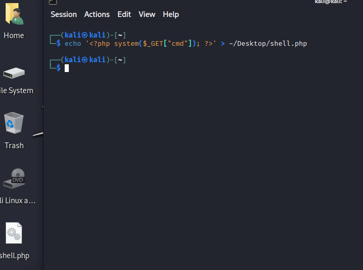
...
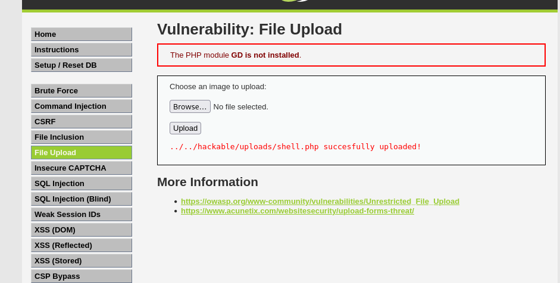
...


### Fase 5: Hardening (Perbaikan)

Langkah-langkah berikut diambil untuk memperbaiki kerentanan:

#### 1\. Memperbaiki Firewall (Security Group)

Aturan *Inbound* pada *Security Group* `Project1-Vulnerable-SG` diperketat:

  * Aturan `All traffic` **dihapus**.
  * Aturan `SSH` diubah *Source*-nya dari `Anywhere (0.0.0.0/0)` menjadi **`My IP`** (spesifik ke IP address saya).
  * Aturan `HTTP` dibiarkan `Anywhere (0.0.0.0/0)` agar web server tetap bisa diakses publik.

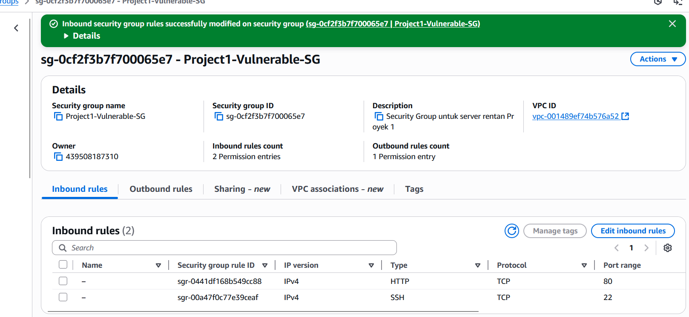    

#### 2\. Memperbaiki Izin File Server

Izin `777` dicabut dan diganti dengan izin yang lebih aman menggunakan `chown` dan `chmod`. Folder `uploads` diberi izin `775` dan `config.inc.php` diberi `664`.

```bash
sudo chown -R www-data:www-data /var/www/html/dvwa
sudo find /var/www/html/dvwa -type d -exec chmod 755 {} \;
sudo find /var/www/html/dvwa -type f -exec chmod 644 {} \;
sudo chmod 775 /var/www/html/dvwa/hackable/uploads
sudo chmod 664 /var/www/html/dvwa/config/config.inc.php
```

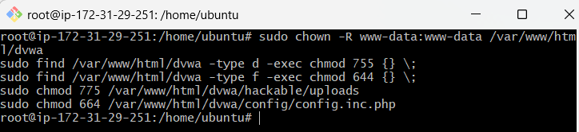

#### 3\. Memperbaiki Konfigurasi Apache

Konfigurasi Apache (`000-default.conf`) dimodifikasi untuk:

  * Menonaktifkan *Directory Indexing* (menghapus `Indexes` dari `Options`).
  * Memblokir akses ke direktori `.git` menggunakan `<DirectoryMatch>`.

<!-- end list -->

```apache
<Directory /var/www/html>
    Options FollowSymLinks MultiViews
    AllowOverride All
    Require all granted
</Directory>

<DirectoryMatch "/\.git(/.*)?$">
    Require all denied
</DirectoryMatch>
```

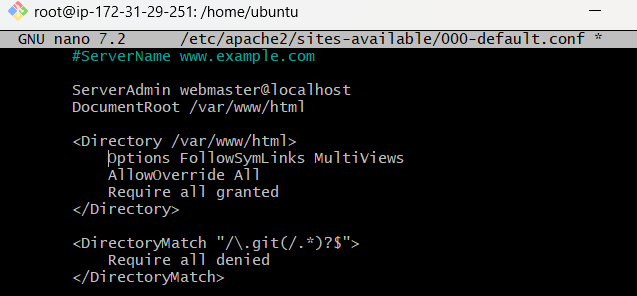

Apache di-restart setelah perubahan konfigurasi:

```bash
sudo systemctl daemon-reload
sudo systemctl restart apache2
```

#### 4\. Menonaktifkan Eksekusi PHP di Folder Uploads (`.htaccess`)

Karena izin file `644` saja tidak cukup menghentikan eksekusi PHP pada konfigurasi server ini, file `.htaccess` ditambahkan di `/var/www/html/dvwa/hackable/uploads/` dengan isi:

```apache
<Files "*.php">
    Require all denied
</Files>
php_flag engine off
```

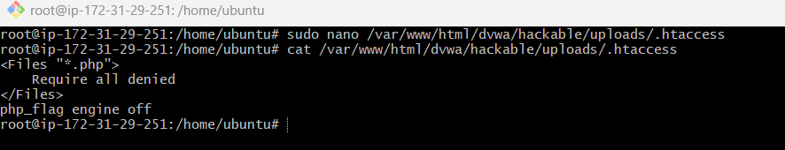

Tindakan ini secara eksplisit memblokir akses dan mematikan *engine* PHP di direktori *uploads*.

#### 5\. Verifikasi Hardening

  * **Directory Indexing:** Mengakses `http://98.93.196.5/dvwa/config/` sekarang menghasilkan **403 Forbidden**.
  * **Web Shell Execution:** Mengakses *web shell* yang sebelumnya berhasil (`.../shell.php?cmd=whoami`) sekarang menghasilkan **403 Forbidden**, membuktikan eksekusi PHP di folder *uploads* telah diblokir.

**Kesimpulan Hardening:** Dengan kombinasi perbaikan *Security Group*, izin file, konfigurasi Apache, dan `.htaccess`, kerentanan utama yang dieksploitasi sebelumnya berhasil ditutup. Server kini jauh lebih aman.

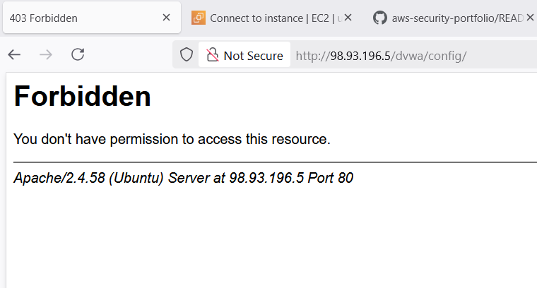
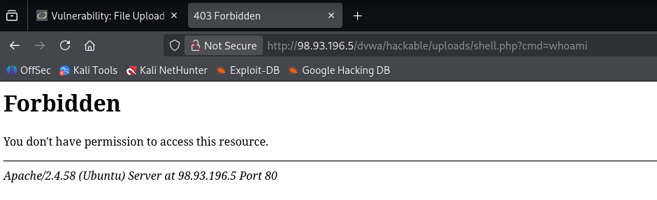

## Detail Proyek 2: "Flag API" Serverless

Proyek ini bertujuan membuat API sederhana untuk mengecek *flag* CTF tanpa perlu mengelola server. Saya menggunakan **AWS Lambda** untuk kode logikanya dan **AWS API Gateway** sebagai *endpoint* HTTP.

### Fase 1: Membuat Fungsi Lambda (Logika Pengecekan)

Langkah pertama adalah membuat fungsi Lambda yang akan berisi kode Python untuk memeriksa *flag*.

1.  **Mencari Layanan Lambda:** Dari AWS Management Console, saya mencari layanan "Lambda".
    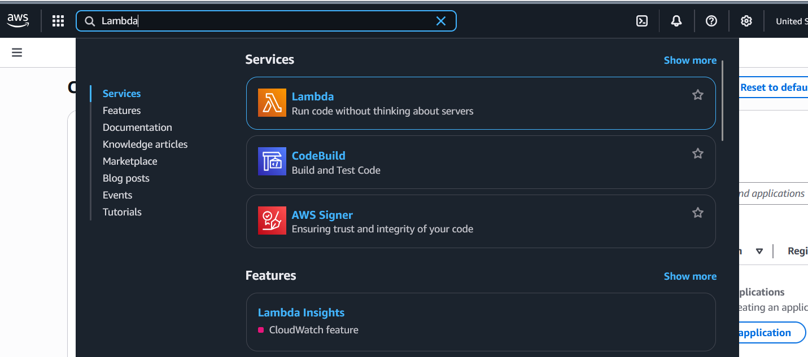

2.  **Memulai Pembuatan Fungsi:** Di halaman Lambda, saya klik "Create function".
    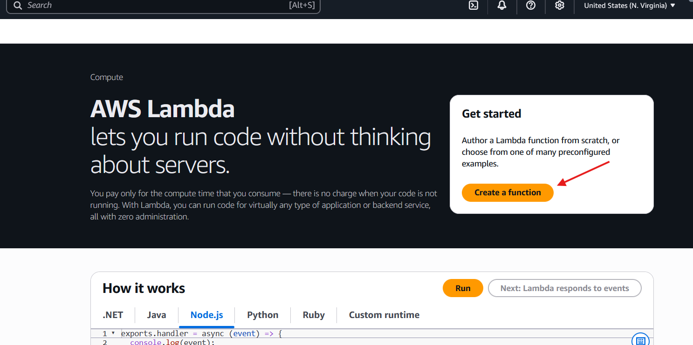

3.  **Konfigurasi Dasar:** Saya memilih "Author from scratch", memberi nama fungsi `flag-checker-api`, dan memilih `Python 3.13` sebagai *runtime*.
    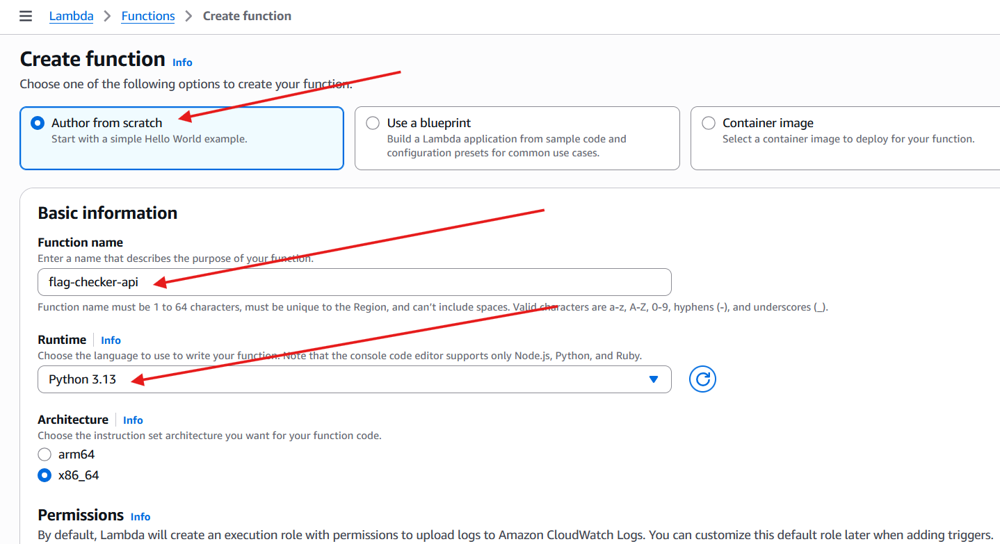

4.  **Konfigurasi Izin:** Saya membiarkan opsi *default* "Create a new role with basic Lambda permissions" agar AWS otomatis membuatkan *role* IAM dasar. Setelah itu klik "Create function".
    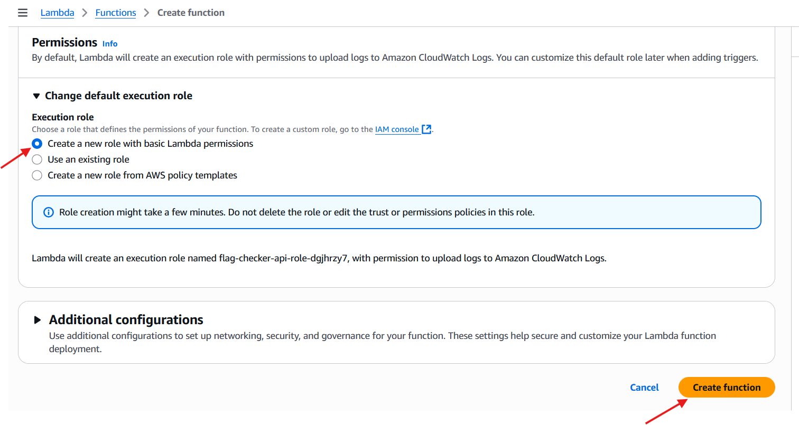

5.  **Editor Kode:** Fungsi berhasil dibuat dan saya diarahkan ke editor kode *online*.
    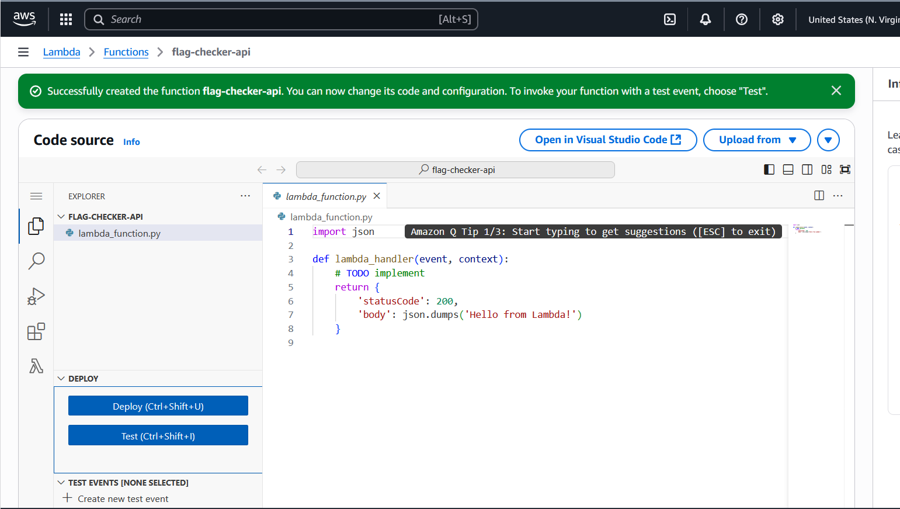

6.  **Menulis Kode Logika:** Saya mengganti kode *template* dengan kode Python berikut:
    ```python
    import json

    # Bisa didefinisikan lagi flag yang benar (seharusnya disimpan lebih aman, tapi ini hanya contoh saja)
    CORRECT_FLAG = "CTF{th1s_1s_th3_s3cr3t_fl4g}"

    def lambda_handler(event, context):
        """
        Fungsi utama Lambda untuk mengecek flag yang dikirim via API Gateway.
        """
        print(f"Received event: {json.dumps(event)}") # Mencatat event yang masuk ke log
        response_body = {}
        status_code = 200
        try:
            if 'body' in event and event['body']:
                body = json.loads(event['body'])
                submitted_flag = body.get('flag')
            else: submitted_flag = None
            if submitted_flag:
                if submitted_flag == CORRECT_FLAG:
                    response_body = {'message': 'Flag Benar! Selamat!'}
                else:
                    response_body = {'message': 'Flag Salah. Coba lagi.'}; status_code = 400
            else:
                response_body = {'message': 'Harap kirim flag dalam format JSON: {"flag": "nilai_flag"}'}; status_code = 400
        except json.JSONDecodeError:
            response_body = {'message': 'Body request harus dalam format JSON yang valid.'}; status_code = 400
        except Exception as e:
            response_body = {'message': f'Internal server error: {str(e)}'}; status_code = 500
        return {
            'statusCode': status_code,
            'headers': { 'Content-Type': 'application/json', 'Access-Control-Allow-Origin': '*' },
            'body': json.dumps(response_body)
        }
    ```

7.  **Deploy Kode:** Setelah menempelkan kode, saya klik tombol "Deploy".
    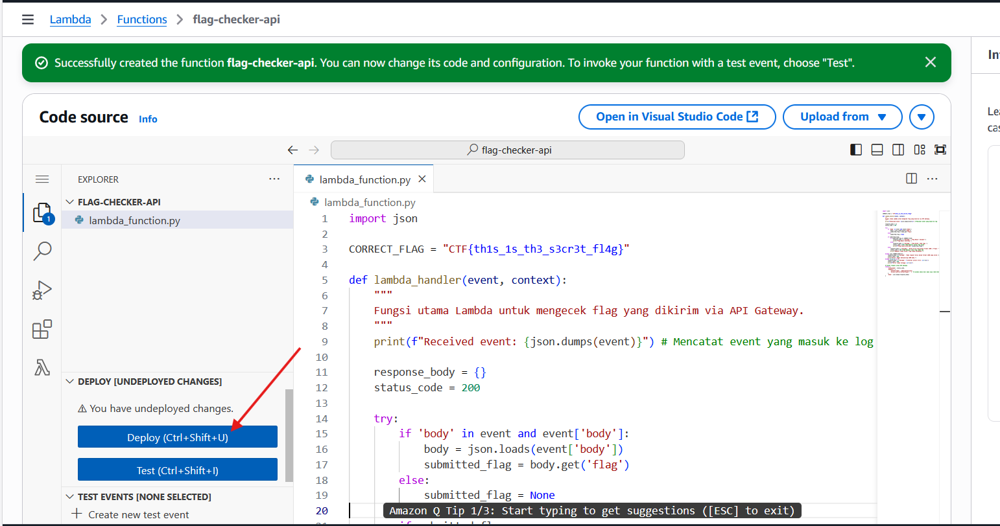
    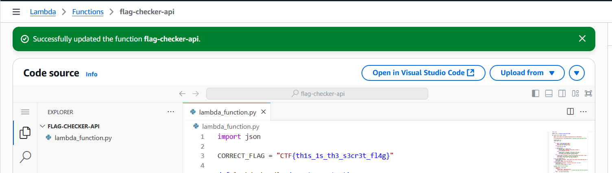

### Fase 2: Membuat API Gateway (Endpoint HTTP)

Selanjutnya, saya membuat *endpoint* HTTP publik menggunakan **API Gateway**.

1.  **Mencari Layanan API Gateway:** Kembali ke AWS Console, saya mencari "API Gateway".
    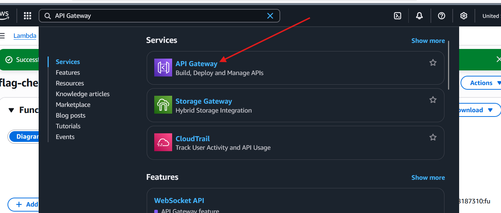

2.  **Memulai Pembuatan API:** Di halaman API Gateway, saya klik "Create API".
    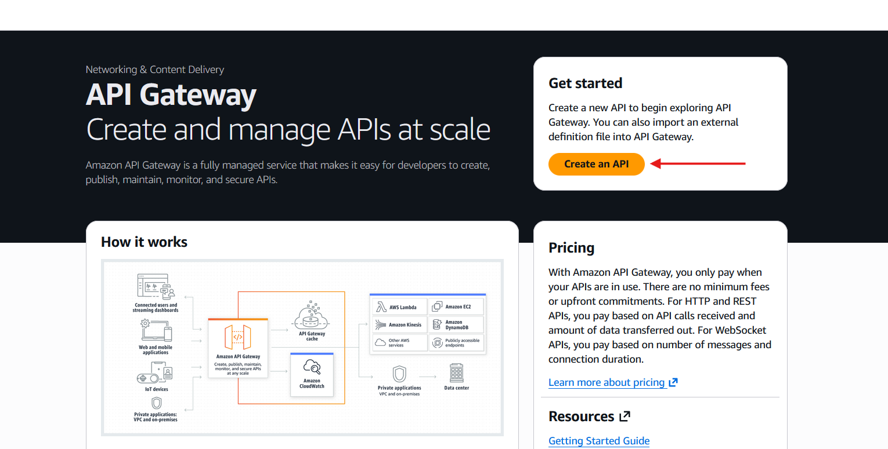

3.  **Memilih Tipe REST API:** Saya memilih tipe **REST API** (Publik) dan klik "Build".
    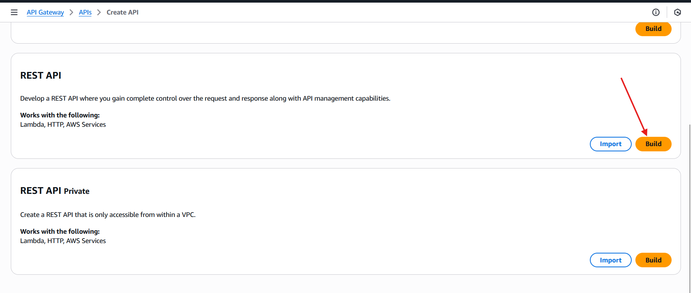

4.  **Konfigurasi Dasar API:** Saya memilih "New API", memberi nama `FlagCheckerAPI`, deskripsi (opsional), dan membiarkan *Endpoint Type* "Regional", lalu klik "Create API".
    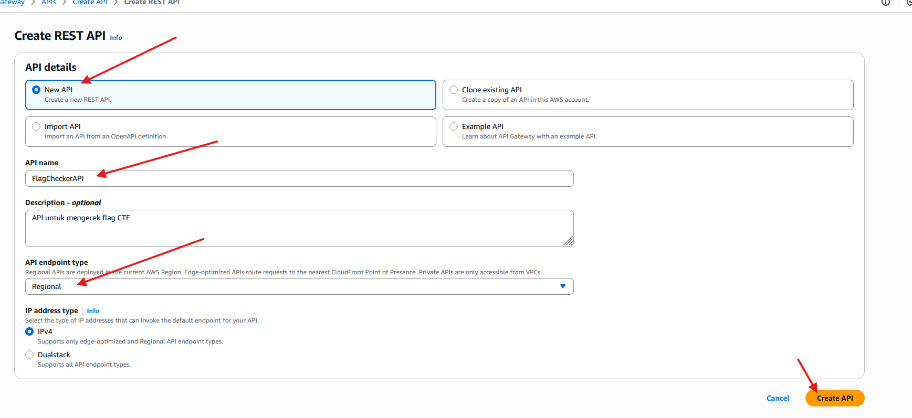

5.  **Membuat Resource:** Di panel *Resources*, saya klik "Actions" > "Create resource".
    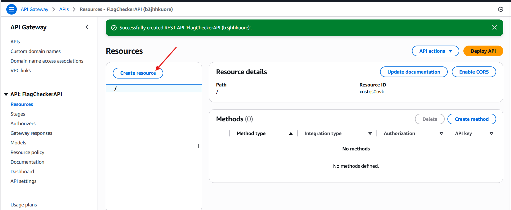
    Saya memberi nama *resource* `checkflag` dan klik "Create resource".
    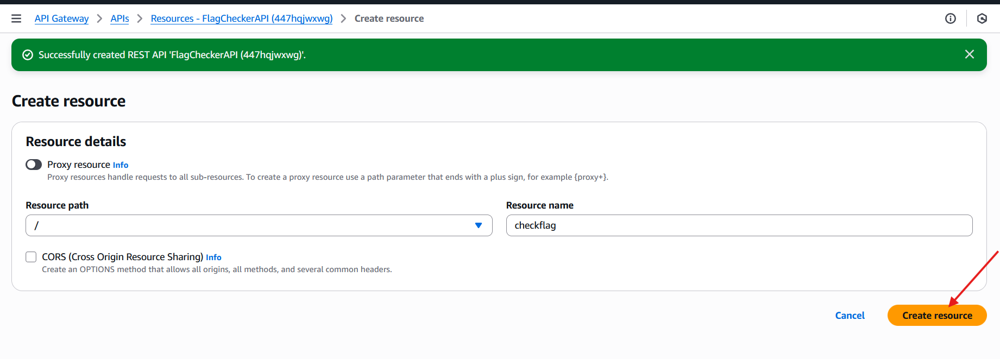

6.  **Membuat Method:** Dengan *resource* `/checkflag` terpilih, saya klik "Actions" > "Create Method".
    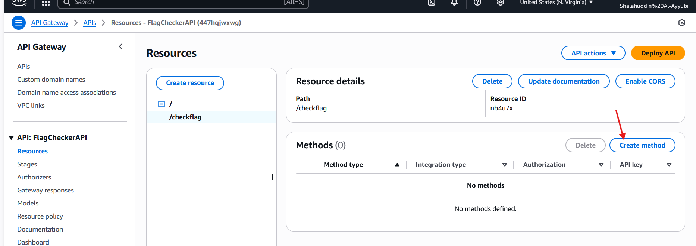
    Saya memilih `POST` dari *dropdown* dan klik tanda centang (✓).

7.  **Konfigurasi Integrasi Lambda:** Pada halaman setup *method* POST:
    * **Integration type:** `Lambda Function`
    * **Use Lambda Proxy integration:** Dicentang ✅
    * **Lambda Function:** Memilih fungsi `flag-checker-api` yang sudah dibuat.
    * Kemudian klik **Save** dan **OK** pada *pop-up* izin.
    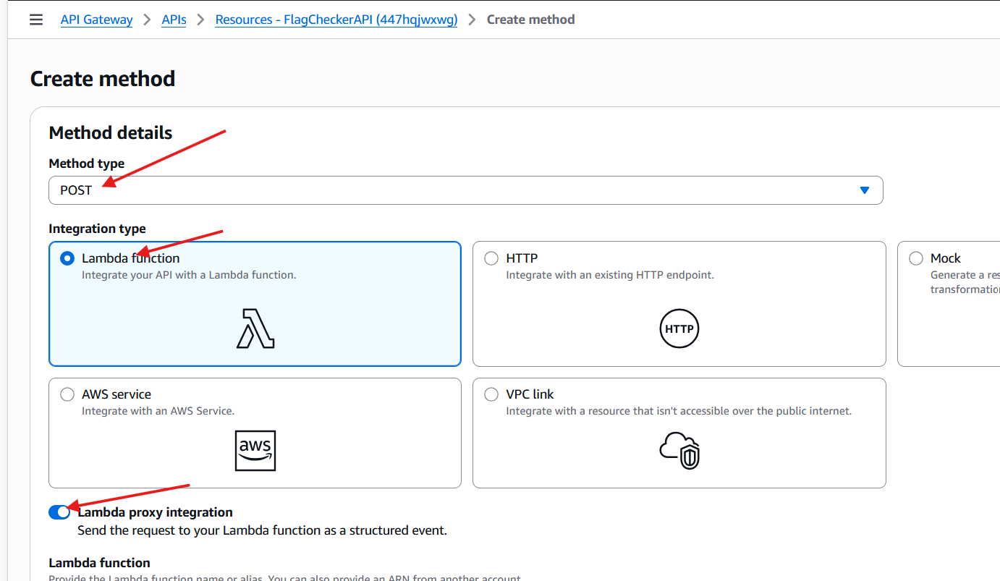
    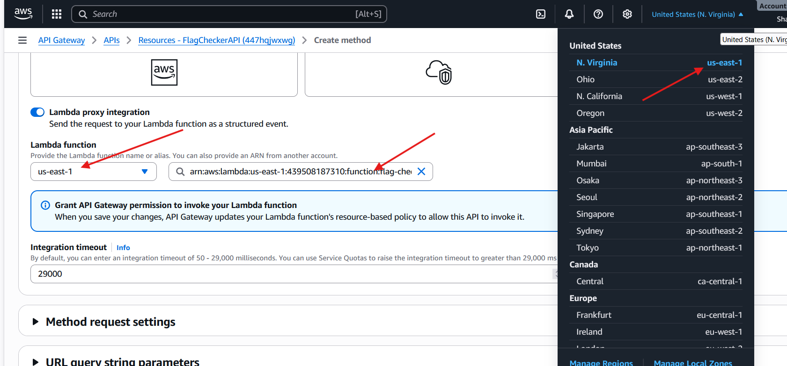

8.  **Deploy API:** Saya klik tombol "Deploy API".
    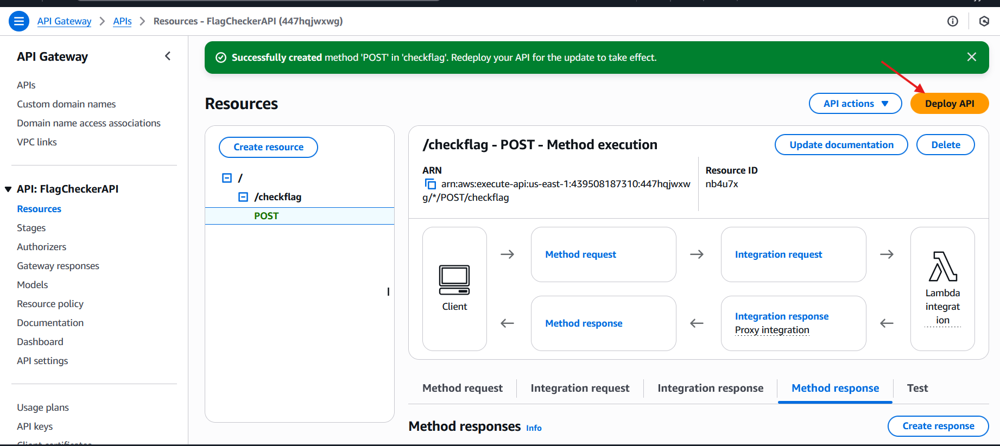
    Saya membuat *stage* baru dengan nama `prod` dan klik "Deploy".
    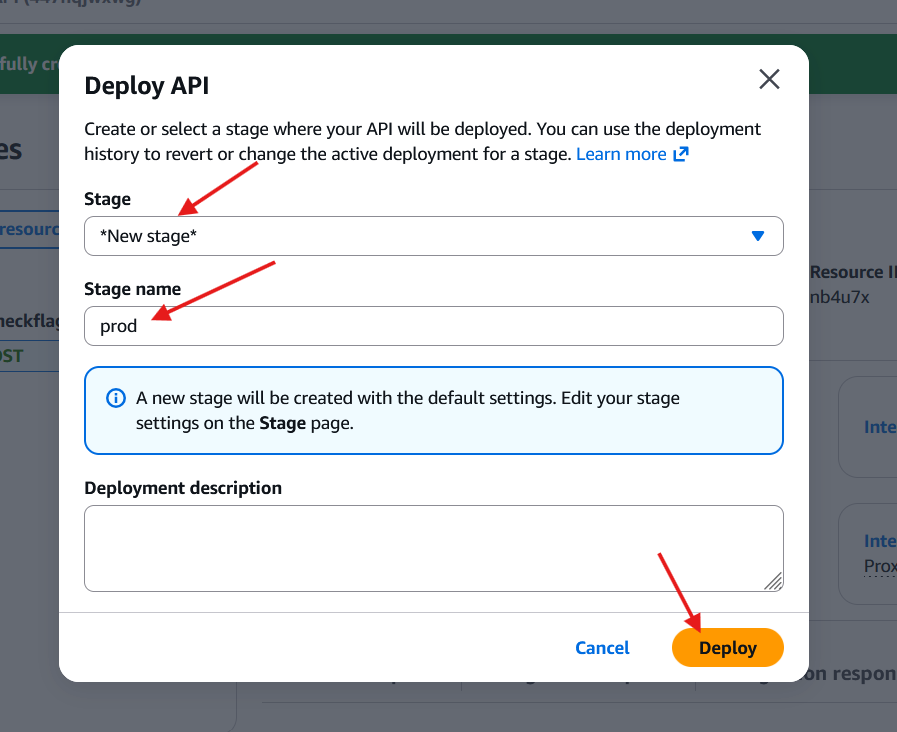

9.  **Mendapatkan Invoke URL:** Setelah *deploy*, API Gateway menampilkan **Invoke URL** untuk *stage* `prod`. URL *endpoint* lengkapnya adalah URL ini ditambah `/checkflag`.
    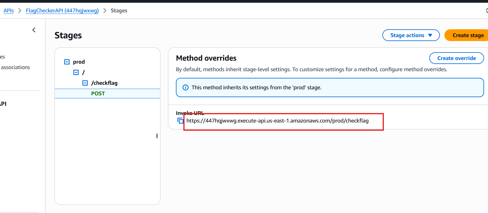
    * **Endpoint URL:** `https://447hqjwxwg.execute-api.us-east-1.amazonaws.com/prod/checkflag`

### Fase 3: Pengujian API

Saya menguji *endpoint* API menggunakan `curl` dari terminal:

* **Tes Flag Benar:**
    ```bash
    curl -X POST \
      [https://447hqjwxwg.execute-api.us-east-1.amazonaws.com/prod/checkflag](https://447hqjwxwg.execute-api.us-east-1.amazonaws.com/prod/checkflag) \
      -H 'Content-Type: application/json' \
      -d '{"flag": "CTF{th1s_1s_th3_s3cr3t_fl4g}"}'
    ```
    * **Respons:** `{"message": "Flag Benar! Selamat!"}` ✅
        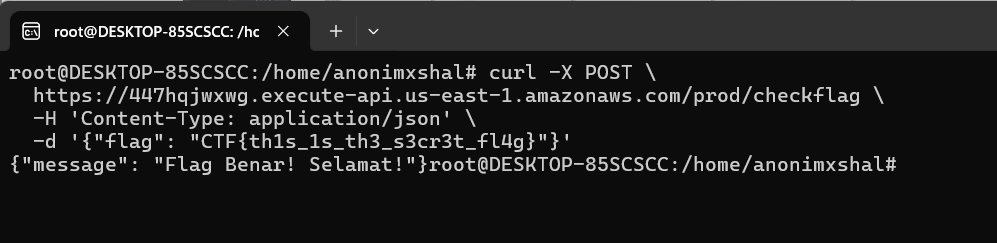

* **Tes Flag Salah:**
    ```bash
    curl -X POST \
      [https://447hqjwxwg.execute-api.us-east-1.amazonaws.com/prod/checkflag](https://447hqjwxwg.execute-api.us-east-1.amazonaws.com/prod/checkflag) \
      -H 'Content-Type: application/json' \
      -d '{"flag": "flag_salah_coba_coba"}'
    ```
    * **Respons:** `{"message": "Flag Salah. Coba lagi."}` ✅
        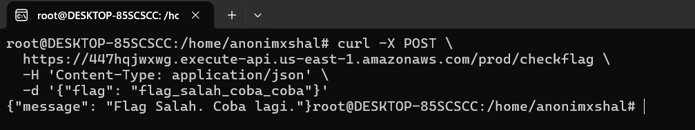

**Kesimpulan Proyek 2:** Berhasil membuat dan menguji API *serverless* sederhana menggunakan AWS Lambda dan API Gateway untuk validasi input. Ini menunjukkan pemahaman dasar arsitektur *serverless* di AWS.
