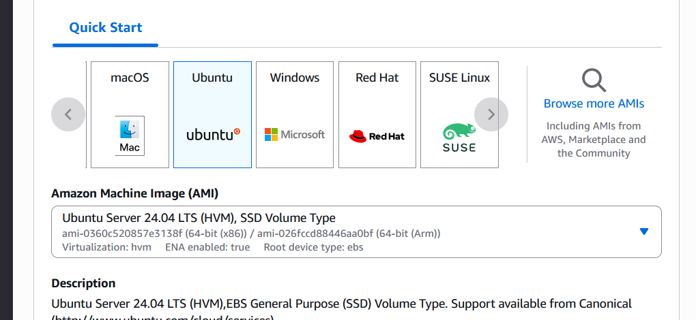
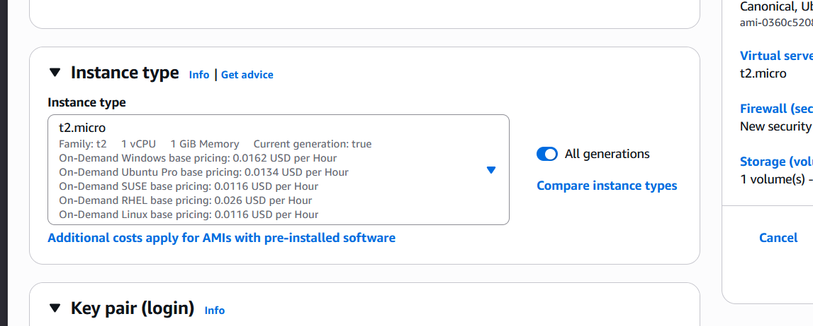
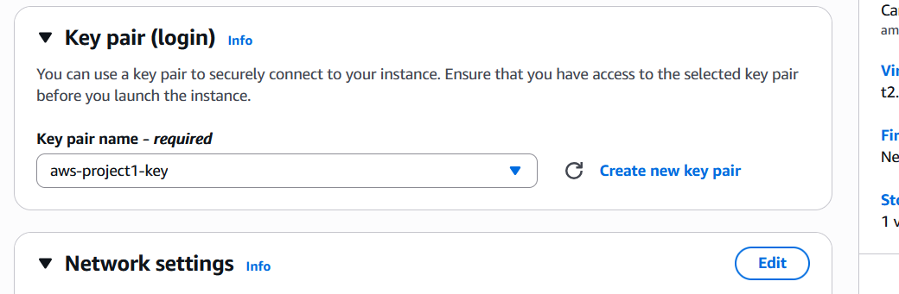
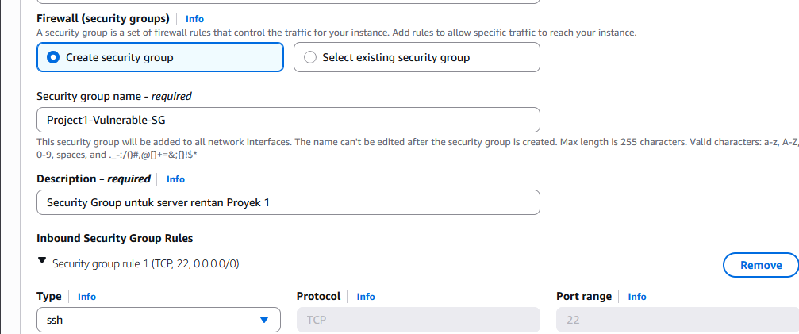
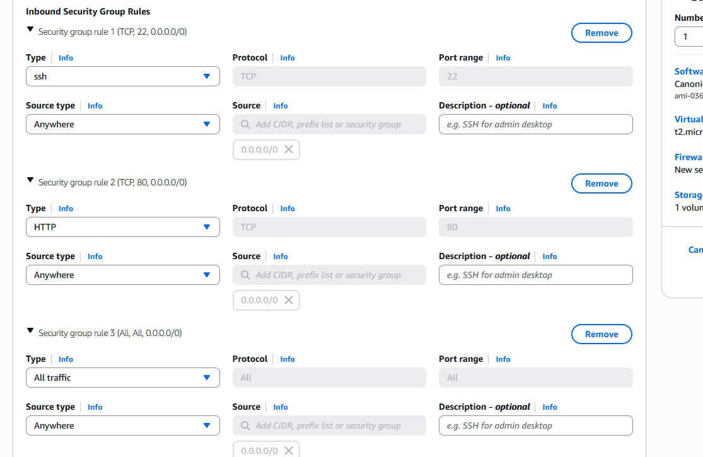

# Portofolio Keamanan AWS - Shalahuddin Al-Ayyubi

Selamat datang di portofolio proyek keamanan cloud saya. Repositori ini berisi dokumentasi dan artefak dari proyek-proyek yang saya kerjakan untuk mendemonstrasikan keahlian saya di bidang AWS, Pentesting, dan Otomatisasi Keamanan.

---

## Daftar Proyek

### Proyek 1: Analisis Kerentanan & Hardening EC2
* **Tujuan:** Mensimulasikan server yang sengaja dibuat rentan di AWS EC2, melakukan pemindaian keamanan, dan kemudian melakukan *hardening* (perbaikan) menggunakan AWS Security Groups dan Network ACLs.
* **Teknologi:** `AWS EC2`, `Security Groups`, `Apache2`, `PHP`, `MySQL`, `DVWA`, `Nmap`.
* **Status:** `Fase Setup Selesai - Siap untuk Pentesting`

### Proyek 2: "Flag API" Serverless
* **Tujuan:** Membangun sebuah API sederhana untuk *submit flag* CTF menggunakan arsitektur *serverless* (tanpa server).
* **Teknologi:** `AWS Lambda`, `AWS API Gateway`, `Python`.
* **Status:** `Belum Dimulai`

### Proyek 3: Mini-CTF dengan Scoreboard
* **Tujuan:** Menggabungkan Proyek 1 & 2 untuk membuat sebuah platform mini-CTF lengkap dengan *scoreboard* yang dinamis.
* **Teknologi:** `AWS EC2`, `Lambda`, `API Gateway`, `DynamoDB`.
* **Status:** `Belum Dimulai`

---

## Detail Proyek 1: Analisis Kerentanan & Hardening EC2

Proyek ini dibagi menjadi beberapa fase. Fase pertama adalah *setup* infrastruktur dan aplikasi yang sengaja dibuat rentan.

### Fase 1: Setup Infrastruktur (AWS EC2)

Saya memulai dengan meluncurkan sebuah *instance* EC2 baru dengan konfigurasi berikut:
* **Name:** `Project1-Vulnerable-Server`
* **OS (AMI):** `Ubuntu Server 24.04 LTS` (Free tier eligible)
* **Instance Type:** `t2.micro` (Free tier eligible)
* **Key Pair:** `aws-project1-key` (dibuat baru dan disimpan dengan aman)
* 
* 
* 
* 

* #### Konfigurasi Firewall (Security Group)
Bagian terpenting adalah konfigurasi *Security Group*. Untuk tujuan proyek ini, saya **sengaja membuat aturan yang sangat tidak aman** agar bisa dianalisis nanti.

* **Security Group Name:** `Project1-Vulnerable-SG`
* **Inbound Rules:**
    1.  `Type: SSH` (Port 22), `Source: Anywhere (0.0.0.0/0)`
    2.  `Type: HTTP` (Port 80), `Source: Anywhere (0.0.0.0/0)`
    3.  `Type: All traffic` (All ports), `Source: Anywhere (0.0.0.0/0)`




### Fase 2: Setup Server & Aplikasi Rentan (DVWA)

Setelah *instance* berjalan, saya terhubung ke server menggunakan SSH dan file `.pem` saya.

1.  **Update Server:** Pertama, saya memperbarui semua *package manager*.
    ```bash
    apt update && apt upgrade -y
    ```
    ```
    [Sisipkan Screenshot 2025-10-26 013904.png di sini]
    ```

2.  **Instal LAMP Stack:** Saya menginstal Apache (Web Server), MySQL (Database), dan PHP.
    ```bash
    apt install apache2 -y
    apt install php libapache2-mod-php php-mysql mysql-server -y
    ```
    ```
    [Sisipkan Screenshot 2025-10-26 014011.png di sini]
    [Sisipkan Screenshot 2025-10-26 014254.png di sini]
    ```

3.  **Verifikasi Web Server:** Saya mengakses IP Publik server (`http://50.99.196.5`) dari browser dan memverifikasi bahwa halaman default Apache telah aktif.
    ```
    [Sisipkan Screenshot 2025-10-26 014118.jpg di sini]
    ```

4.  **Instal DVWA:** Saya mengunduh (clone) aplikasi *Damn Vulnerable Web Application* (DVWA) dari GitHub.
    ```bash
    git clone [https://github.com/digininja/DVWA.git](https://github.com/digininja/DVWA.git) /var/www/html/dvwa
    ```

5.  **Konfigurasi Izin (Sengaja Dibuat Rentan):** Saya memberikan izin `777` (baca, tulis, eksekusi untuk semua) ke folder DVWA.
    ```bash
    chmod -R 777 /var/www/html/dvwa
    ```

6.  **Setup Database & DVWA:** Saya mengkonfigurasi file `config.inc.php` DVWA dan membuat database MySQL yang diperlukan. Setelah me-restart Apache, saya berhasil mengakses halaman login DVWA dan menyelesaikan setup.

### Fase 3: Analisis Kerentanan Awal

Server ini sekarang memiliki beberapa kerentanan kritis yang disengaja:

1.  **Kerentanan Infrastruktur (Security Group):**
    * **SSH (Port 22) terbuka untuk `0.0.0.0/0`:** Ini sangat berisiko. Ini mengizinkan *siapa saja* di internet untuk mencoba serangan *brute force* (menebak password/key) terhadap server saya.
    * **All traffic terbuka untuk `0.0.0.0/0`:** Ini lebih parah. Ini membuka *semua port*, termasuk port sensitif seperti database (`MySQL - 3306`) ke seluruh internet. Penyerang bisa langsung terhubung ke database saya dari mana saja.

2.  **Kerentanan Server (Izin File):**
    * **`chmod 777`:** Ini adalah mimpi buruk keamanan. Ini berarti *user* web server (`www-data`) memiliki izin untuk *menulis* dan *mengeksekusi* file di dalam folder DVWA.
    * **Implikasi:** Jika seorang penyerang berhasil menemukan celah *file upload* di DVWA (yang memang ada), mereka dapat mengunggah *web shell* (misalnya `shell.php`). Karena izin `777`, server akan mengizinkan file itu dieksekusi, memberikan penyerang kendali penuh (Remote Code Execution) atas server saya.

3.  **Kerentanan Aplikasi (DVWA):**
    * Aplikasi DVWA sendiri sengaja dibuat penuh dengan celah, seperti **SQL Injection**, **Cross-Site Scripting (XSS)**, dan **File Inclusion**, yang akan saya gunakan sebagai target pengujian.

### Fase 4: Rencana Pengujian (Pentesting)

Dengan setup ini, server saya siap untuk diuji. Rencana selanjutnya adalah:
1.  **Reconnaissance:** Melakukan pemindaian `nmap` dari komputer lokal saya (atau Kali Linux) terhadap IP publik server untuk mengidentifikasi semua port dan layanan yang terbuka.
2.  **Vulnerability Assessment:** Menggunakan *tools* untuk memindai kerentanan yang ada di DVWA.
3.  **Exploitation:** Mencoba mengeksploitasi celah yang ada:
    * Melakukan **SQL Injection** untuk mengambil data dari database.
    * Mencoba **File Upload** untuk mengunggah *web shell*, memanfaatkan izin `chmod 777`.
